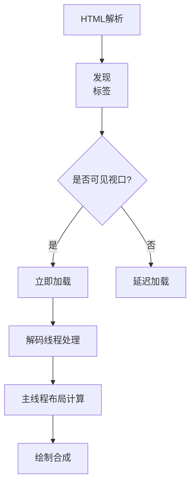
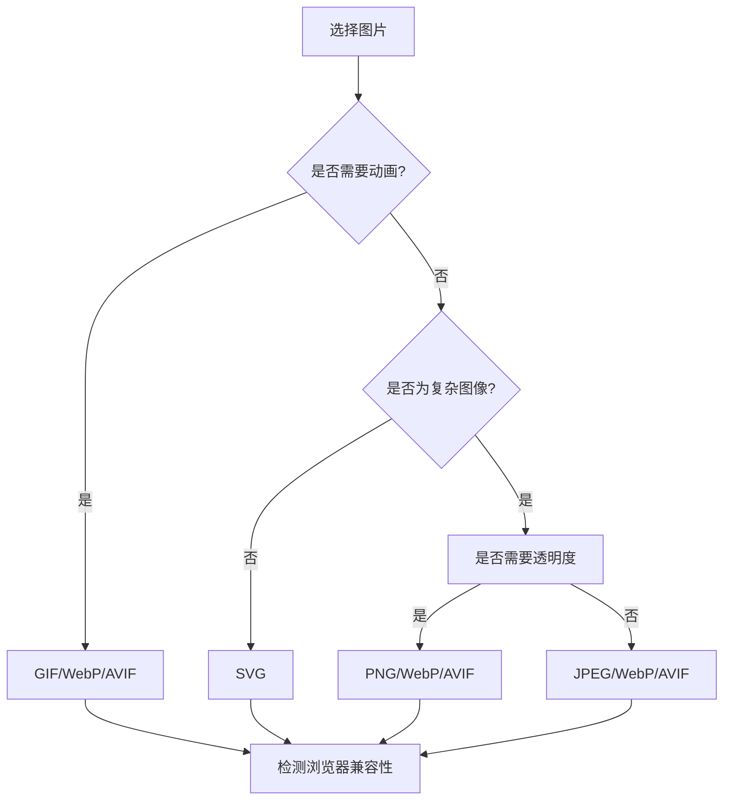
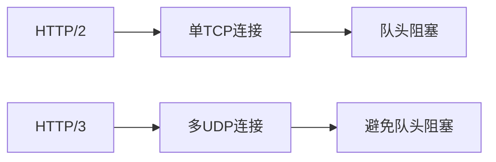

# 前言

在Web开发中，图片处理是影响用户体验和网站性能的关键因素。前端开发者每天都要面对一系列图片相关的技术决策：

- **静态图片格式**：选择PNG还是JPG追求更小体积？
- **动态图像选择**：GIF还是APNG？
- **压缩策略**：如何在保持视觉质量的前提下减小文件大小？
- **格式应用**：web端图片是否要转化成 WebP 还是 AVIF？

这些决策直接影响着首屏加载时间、带宽消耗和用户交互体验等核心指标，甚至将影响业务的商业转化率。图片处理其实也考验着一个前端的基本功，本文将深入解析常见图片格式的编码原理，结合浏览器渲染机制与现代Web标准，提供一套科学、可落地的图片优化实践方案。

---

# 一、图片格式

在选择图片格式之前首先要清楚这些图片格式的特点和区别

## 1. 类型

图片格式主要分为两种类型：位图和矢量图。我们常见的图片除了 `SVG` 都是位图

### 位图

位图是由`像素点`组成的，适合照片和复杂图像，其清晰度由分辨率和像素总量共同决定。

### 矢量图

矢量图是通过`代码`或者说是用数学公式描述的

1.  `优点`是在任何缩放比例下都可以展示得很清晰而不会失真
2.  `缺点`是细节的展示效果不够丰富，对于复杂图像来说，比如要达到照片的效果，若通过SVG进行矢量图绘制，需要大量的代码描述，生成文件就会非常大，并且浏览器解析和渲染对很耗性能，所以svg不适合细节丰富的图像，只适合图标和简单图形。

## 2. 压缩方式

图片格式不同的压缩方法由图像编码标准决定:

1.  **JPG（有损压缩）**

    - **原理**：通过丢弃人眼不敏感的细节（如高频色彩信息）来减少文件体积。
    - **特点**：
      - 压缩率极高，适合照片类图像（色彩丰富、渐变多）。
      - 不支持透明度，多次保存会累积质量损失（“代际损失”）。

2.  **PNG（无损压缩）**

    - **原理**：使用 DEFLATE 算法无损压缩像素数据，保留所有原始信息。
    - **特点**：
      - 适合图标、线条图等需要保留锐利边缘的图像。
      - 支持透明度，文件体积通常比 JPEG 大。

3.  **WebP**：集 JPEG 和 PNG 优点于一身。无损压缩比 PNG 小 26%，有损压缩比 JPEG 小 25-34%，并且支持透明通道。

4.  **AVIF**：更先进的压缩算法，压缩率比 WebP 还高 30%。但兼容性较差，目前浏览器支持率只有 86%。

而我们开发过程中经常对图片进行二次压缩(`同格式`)，比如借助 TinyPng 工具，实际上是对图片进行`有损压缩`：

1.  **量化减少颜色数量**：将 1600 万色（24-bit）缩减到 256 色（8-bit）。
2.  **丢弃元数据**：删除 EXIF、ICC 配置等非必要数据。
3.  **优化压缩算法**：使用改进的 DEFLATE 算法更高效压缩数据。

虽然 PNG 本身是无损格式，但 TinyPNG 通过有损预处理+无损压缩的组合，实现了“视觉无损”的高压缩率。

## 3. **图片格式总结**

| 格式     | 类型   | 压缩方式      | 透明度支持 | 动画支持 | 特点                                       | 适用场景                     |
| -------- | ------ | ------------- | ---------- | -------- | ------------------------------------------ | ---------------------------- |
| **JPEG** | 位图   | 有损          | ❌         | ❌       | 高压缩率，适合照片，但压缩过度会失真       | 照片、复杂色彩图像           |
| **PNG**  | 位图   | 无损          | ✅ (Alpha) | ❌       | 支持透明，无损压缩，文件较大               | 透明图标、精确图形（如截图） |
| **GIF**  | 位图   | 无损（256色） | ✅ (1-bit) | ✅       | 支持简单动画，但色彩有限                   | 表情包、简单动画             |
| **WebP** | 位图   | 有损/无损     | ✅ (Alpha) | ✅       | 现代格式，压缩效率高，支持动画和透明度     | 全能替代（JPEG/PNG/GIF）     |
| **AVIF** | 位图   | 有损/无损     | ✅ (Alpha) | ✅       | 下一代压缩，比WebP更高效，但兼容性差       | 高质量图片、未来项目         |
| **APNG** | 位图   | 无损          | ✅ (Alpha) | ✅       | PNG的动画扩展，支持全透明动画              | 高质量动画（替代GIF）        |
| **SVG**  | 矢量图 | 无损          | ✅         | ❌       | 无限缩放，通过代码描述图形，支持CSS/JS控制 | 图标、LOGO、UI元素           |

---

# 二、浏览器渲染机制与性能影响

## 1. 关键渲染路径中的图片处理



浏览器的图片渲染流程可以分为以下阶段：

### **1. 解析与加载**

- **HTML 解析**：浏览器解析 HTML 时遇到 `` 标签，立即发起图片资源的网络请求（除非使用 `loading="lazy"` 延迟加载）。
- **优先级控制**：图片的加载优先级通常低于关键资源（如 CSS、JS），但可通过 `fetchpriority="high"` 调整。
- **预加载优化**：使用 `<link rel="preload">` 提前加载关键图片。

#### **2. 解码（Decoding）**

- **主线程阻塞**：图片解码（将二进制数据转换为像素）默认在主线程执行，大图片可能导致主线程卡顿。

- **异步解码**：通过 `img.decode()` API 异步解码图片，避免阻塞主线程。

- **格式影响**：

  - **JPEG/PNG**：解码复杂度较高。
  - **WebP/AVIF**：现代格式解码效率更高。

#### **3. 布局（Layout）与绘制（Paint）**

- **布局计算**：图片尺寸变化（未指定 `width/height`）会导致布局重排（Reflow）。
- **图层分离**：使用 `will-change: transform` 或 `transform: translateZ(0)` 将图片提升到独立图层，减少绘制区域。

#### **4. 合成（Composite）**

- **GPU 加速**：某些 CSS 属性（如 `transform`、`opacity`）触发 GPU 合成，跳过主线程直接由合成器处理。
- **减少重绘**：避免频繁修改图片尺寸或位置，触发不必要的重绘（Repaint）。

## 2. 性能瓶颈分析

- **解码耗时**：高分辨率图片消耗CPU资源（尤其是AVIF/WebP）
- **布局抖动**：未设置尺寸的图片引发回流（CLS问题）
- **内存占用**：4096x4096的RGBA图片占用67MB内存
- **网络竞争**：过多图片请求阻塞关键资源加载

**实测数据**：

- 未优化的2MB JPEG：加载时间≈800ms（4G网络）
- 优化后的200KB WebP：加载时间≈150ms
- LCP（最大内容绘制）提升300ms可使转化率提高5%

---

# 三、性能优化全方案

## 1. 格式选择策略

前面可以得出结论，avif压缩率最高，性能最好，但要考虑兼容性问题，而webp是当前最佳平衡选择，最佳实践我们可以通过代码检测图片格式兼容性。

服务端：浏览器端在发起图片请求时会带上当前浏览器支持的图片格式，可以在服务端判断后返回对应的图片格式。


```javascript
// 动态格式检测
const acceptHeader = req.headers.accept || '';
const supportsWebP = acceptHeader.includes('webp');
const supportsAvif = acceptHeader.includes('avif');

function getBestFormat() {
  if (supportsAvif) return 'avif';
  if (supportsWebP) return 'webp';
  return 'jpg';
}
```

**决策树**：



## 2. 响应式图片技术

响应式图片是现代Web开发的必备技术，可以根据设备屏幕大小和分辨率提供最合适的图片资源。

### srcset 和 sizes 属性

```html

```

### picture 元素实现格式回退

```html
<picture>
  <source srcset="image.avif" type="image/avif" />
  <source srcset="image.webp" type="image/webp" />
  
</picture>
```

## 3. 懒加载策略

### 原生懒加载

```html

```

### 交叉观察器实现

```javascript
const observer = new IntersectionObserver((entries) => {
  entries.forEach((entry) => {
    if (entry.isIntersecting) {
      const img = entry.target;
      img.src = img.dataset.src;
      observer.unobserve(img);
    }
  });
});

document.querySelectorAll('img[data-src]').forEach((img) => {
  observer.observe(img);
});
```

## 4. CDN与缓存优化

- 使用CDN分发图片资源，减少网络延迟
- 设置合理的缓存策略，常见图片可设置长期缓存
- 使用内容哈希命名，便于缓存更新

<!---->

    # Nginx缓存配置示例
    location ~* \.(jpg|jpeg|png|gif|webp|avif)$ {
        expires 30d;
        add_header Cache-Control "public, no-transform";
    }

## 5. 图片预处理与自动化

### 构建时优化

使用webpack、gulp等工具在构建阶段自动处理图片：

```javascript
// webpack配置示例
module.exports = {
  module: {
    rules: [
      {
        test: /\.(png|jpg|gif)$/i,
        use: [
          {
            loader: 'image-webpack-loader',
            options: {
              mozjpeg: {
                progressive: true,
                quality: 65,
              },
              optipng: {
                enabled: false,
              },
              pngquant: {
                quality: [0.65, 0.9],
                speed: 4,
              },
              webp: {
                quality: 75,
              },
            },
          },
        ],
      },
    ],
  },
};
```

### 图片服务API

使用图片处理服务动态调整图片大小和格式：
例如通过阿里云OSS服务通过x-oss-process图片处理参数，将图片进行裁剪、质量变化、格式转化等操作

    <!-- 使用OSS等服务 -->
    

# 四、未来趋势展望

## 1. HTTP/3多路复用

HTTP/3基于QUIC协议，采用UDP传输，解决了HTTP/2中的队头阻塞问题。对于图片密集型应用，多路复用能显著提升并行下载效率，减少等待时间。



## 2. 机器学习驱动的图像压缩

### Google RAISR技术

RAISR (Rapid and Accurate Image Super Resolution) 使用机器学习算法，能在低分辨率图像基础上重建高质量图像，大幅减少传输数据量。

### 神经网络压缩

基于神经网络的压缩算法如Facebook的DLVC (Deep Learning Video Coding)，可将压缩率提高30-50%，同时保持视觉质量。

## 3. WebCodecs API与GPU加速

WebCodecs API允许Web应用直接访问底层媒体编解码器，实现硬件加速：

```javascript
// WebCodecs API示例
async function decodeImage(imageData) {
  const decoder = new ImageDecoder({
    data: imageData,
    type: 'image/avif',
  });

  const result = await decoder.decode();
  return result.image;
}
```

## 4. 新一代图像格式

### JPEG XL

JPEG XL旨在替代JPEG，提供更高压缩率和更丰富的功能：

- 比JPEG小60%，同时提高视觉质量
- 支持无损转换现有JPEG
- 支持动画、透明度和HDR

### WebP 2

Google正在开发WebP的下一代版本，预计将进一步提高压缩效率，并增强动画支持。

# 结语

图片优化是性能工程的艺术，开发需要平衡视觉质量、加载速度与兼容性需求。通过深入理解格式特性、浏览器工作原理，并结合本文提供的全方位优化策略，可以显著提升Web应用的用户体验和业务指标。

随着新技术的不断涌现，图片优化的方法也在持续演进。作为前端开发者，我们需要不断学习和实践，将最佳图片处理方案融入日常开发流程中。
